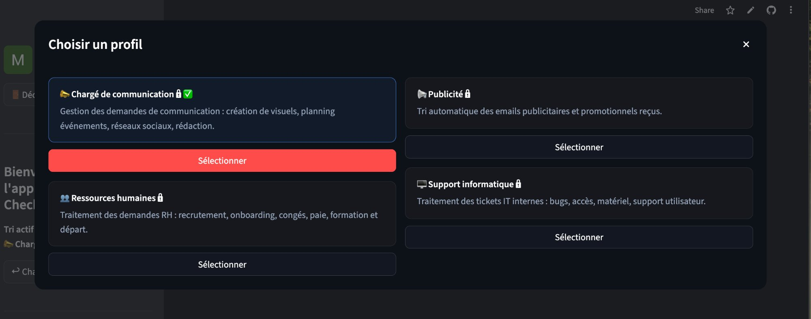
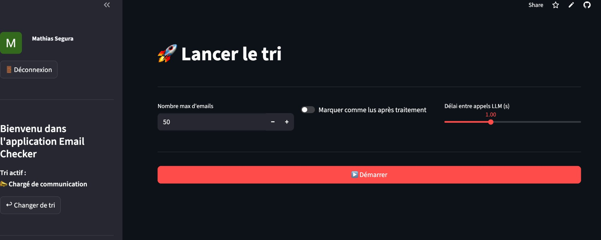
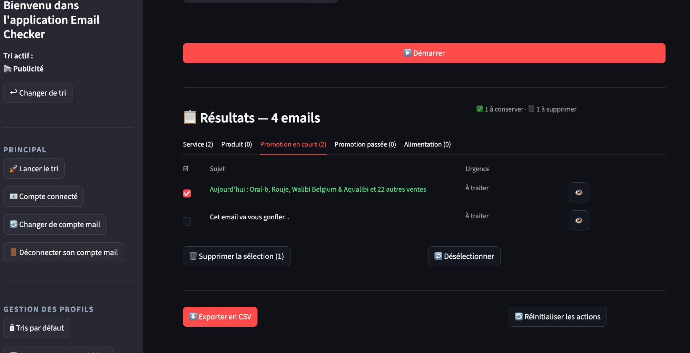
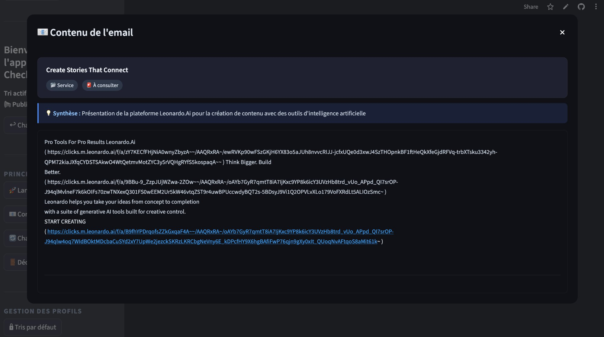
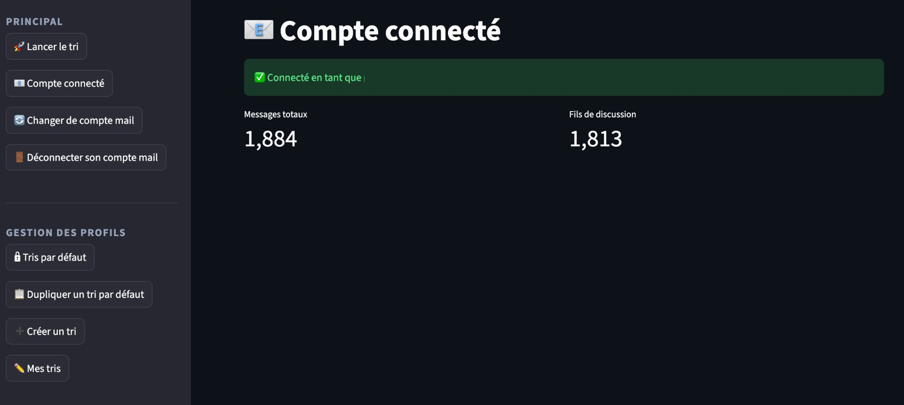
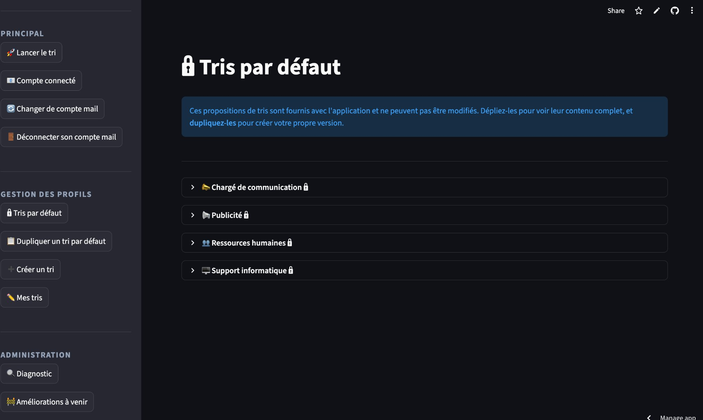
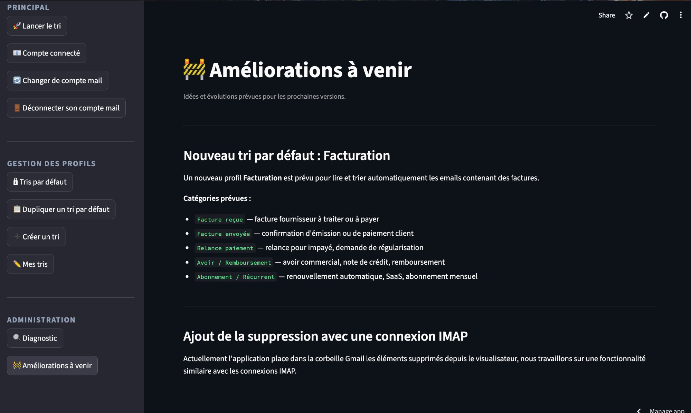

# 🎫 Email Checker

EN — This app is not verified by Google, so any access request via the public link must be submitted to the authors; you can also self-host it locally or on your own Streamlit Cloud instance.

FR — Cette application n'est pas vérifiée par Google, toute demande d'accès via le lien public doit être adressée aux auteurs ; il est également possible de l'installer soi-même en local ou sur son propre Streamlit Cloud.

Application Streamlit qui lit vos emails, les classifie automatiquement par catégorie et urgence grâce à un LLM, et affiche les résultats dans une interface claire.

**Compatible Gmail (OAuth2) et tout compte IMAP (Outlook, Yahoo, OVH...).**

---

## 📸 Aperçu

| Choisir un tri | Lancer le tri |
|---|---|
|  |  |

| Résultats & gestion | Popup contenu email |
|---|---|
|  |  |

| Compte connecté | Tris par défaut |
|---|---|
|  |  |

| Améliorations à venir | |
|---|---|
|  | |
---

## 🚀 Ce que ça fait

1. Connexion à votre boîte mail (Gmail OAuth2 ou IMAP)
2. Récupération des emails non lus
3. Classification automatique par catégorie et urgence via Groq (`llama-3.1-8b-instant`)
4. Affichage des résultats par onglets triés par urgence avec export CSV
5. Visualisation du contenu de chaque email, suppression depuis l'interface (Gmail)

---

## 📦 Installation locale

```bash
git clone https://github.com/Msegura4/email_checker
cd email_checker
python3 -m venv env
source env/bin/activate        # Windows : env\Scripts\activate
pip install -r requirements.txt
streamlit run streamlit_app.py
```

---

## ⚙️ Configuration

### 1. Fichier `.env` (local)

Copier `.env.example` en `.env` et remplir les valeurs :

```env
GROQ_KEY=gsk_votre_clé_ici

# Provider mail : "gmail" ou "imap"
MAIL_PROVIDER=gmail

# Config IMAP (seulement si MAIL_PROVIDER=imap)
IMAP_HOST=imap.gmail.com
IMAP_PORT=993
IMAP_USER=vous@email.com
IMAP_PASSWORD=votre_mot_de_passe
IMAP_FOLDER=INBOX
IMAP_USE_SSL=true
```

### 2. Secrets Streamlit Cloud

Copier `.secrets.toml.example` en `.streamlit/secrets.toml` (local) ou coller dans `Settings > Secrets` sur [share.streamlit.io](https://share.streamlit.io) :

```toml
GROQ_KEY             = "gsk_xxxx"
GOOGLE_CLIENT_ID     = "xxxx.apps.googleusercontent.com"
GOOGLE_CLIENT_SECRET = "GOCSPX-xxxx"
REDIRECT_URI         = "https://votre-app.streamlit.app"

# Optionnel : pré-remplir la config IMAP
MAIL_PROVIDER  = "imap"
IMAP_HOST      = "imap.gmail.com"
IMAP_PORT      = "993"
IMAP_USER      = "vous@email.com"
IMAP_PASSWORD  = "xxxx"
IMAP_FOLDER    = "INBOX"
IMAP_USE_SSL   = "true"
```

---

## 🔐 Connexion Gmail (OAuth2)

### Étape 1 — Projet Google Cloud

1. Aller sur [console.cloud.google.com](https://console.cloud.google.com)
2. **Créer un projet** (ex : `emailchecker`)
3. **API et services → Activer des API** → activer `Gmail API`
4. **Identifiants → Créer des identifiants → ID client OAuth 2.0**
   - Type : **Application Web**
   - URI de redirection : URL de votre app Streamlit (ex : `https://emailchecker-azerty.streamlit.app`)
5. Récupérer `client_id` et `client_secret`

### Étape 2 — Écran de consentement

1. **API et services → Écran de consentement OAuth**
2. Type : **Externe**
3. Remplir nom de l'app et email de support
4. **Champs d'application** → ajouter :
   - `https://www.googleapis.com/auth/gmail.readonly`
   - `https://www.googleapis.com/auth/gmail.modify`

### Étape 3 — Ajouter des testeurs ⚠️

Tant que l'app n'est pas vérifiée par Google, **seuls les comptes ajoutés manuellement peuvent se connecter**. Tout autre compte reçoit l'erreur `403 access_denied`.

**Pour autoriser un utilisateur :**
1. **Écran de consentement OAuth → Utilisateurs test → + Add users**
2. Entrer l'adresse Gmail à autoriser → **Save**

L'accès est immédiat. Limite : **100 testeurs** en mode Test.

> Pour ouvrir l'accès à tous sans restriction, il faut soumettre l'app à la vérification Google — processus long qui nécessite une politique de confidentialité publiée.

---

## 📬 Connexion IMAP (Outlook, Yahoo, OVH...)

Aucune configuration Google requise. Sur la page de connexion, cliquer **"Se connecter avec un autre compte mail (IMAP)"** et renseigner les identifiants.

| Service | IMAP_HOST | Port |
|---|---|---|
| Gmail | `imap.gmail.com` | 993 |
| Outlook | `outlook.office365.com` | 993 |
| Yahoo | `imap.mail.yahoo.com` | 993 |
| OVH | `ssl0.ovh.net` | 993 |
| iCloud | `imap.mail.me.com` | 993 |

> **Gmail via IMAP :** activer "Accès IMAP" dans les paramètres Gmail. Si la 2FA est active, générer un **mot de passe d'application** sur [myaccount.google.com/apppasswords](https://myaccount.google.com/apppasswords).

---

## 🗂️ Profils de tri

Un profil définit les **catégories** et **niveaux d'urgence** utilisés pour classifier les emails. Ils sont stockés en JSON dans `profiles/defaults/`.

**4 profils fournis par défaut (lecture seule) :**

| Fichier | Profil | Catégories |
|---|---|---|
| `support_informatique.json` | 🖥️ Support informatique | Problème technique, Accès, Réseau, Matériel... |
| `ressources_humaines.json` | 👥 Ressources humaines | Recrutement, Congés, Paie, Formation... |
| `charge_communication.json` | 📣 Chargé de communication | Création visuelle, Réseaux sociaux, Événement, Rédaction... |
| `publicite.json` | 📢 Publicité | Campagne, Partenariat, Médias, Promotions... |

Depuis l'app : **dupliquer** un profil par défaut pour le personnaliser, ou **créer** un tri from scratch.

---

## 📁 Structure du projet

```
├── streamlit_app.py              # Interface principale Streamlit
├── agent_mail.py                 # Classification LLM (Groq)
├── mail_reader_base.py           # Interface abstraite commune
├── mail_reader_gmail.py          # Lecteur Gmail (OAuth2)
├── mail_reader_imap.py           # Lecteur IMAP
├── mail_reader.py                # Lecteur Gmail standalone (CLI)
├── main.py                       # Point d'entrée CLI
├── profile_manager.py            # Gestion des profils de tri
├── drive_client.py               # Export Google Sheets (CLI)
├── generate_token.py             # Génération token OAuth2 (CLI)
├── profiles/
│   └── defaults/
│       ├── support_informatique.json
│       ├── ressources_humaines.json
│       ├── charge_communication.json
│       └── publicite.json
├── docs/                         # Screenshots pour le README
├── .secrets.toml.example         # Exemple de secrets pour Streamlit Cloud
├── .env.example                  # Exemple de variables d'environnement
├── .gitignore                    # Exclut .env, token.json, credentials.json...
└── requirements.txt
```

---

## 🛠️ Dépannage

| Erreur | Cause | Solution |
|---|---|---|
| `403 access_denied` | Compte non ajouté comme testeur | Google Cloud Console → Écran de consentement → Utilisateurs test → + Add users |
| `429 Groq` | Limite 500k tokens/jour atteinte | Attendre minuit UTC ou réduire le nombre d'emails |
| Timeout récupération | Token expiré ou réseau lent | Cliquer "Se reconnecter" et relancer |
| `IMAP LOGIN failed` | Mauvais identifiants | Vérifier email/mot de passe ou générer un mot de passe d'application |
| `IMAP SSL error` | Port ou SSL incorrect | Essayer port `143` + décocher SSL |
| App blanche | Secrets Streamlit manquants | Vérifier `GOOGLE_CLIENT_ID` et `GOOGLE_CLIENT_SECRET` dans Settings > Secrets |

---

## ⚠️ Limitations connues

- **Session non persistante** : la connexion Google est perdue à chaque rechargement de page
- **100 testeurs max** en mode Test Google (sans vérification de l'app)
- **500k tokens/jour** sur le plan gratuit Groq (~500 emails selon leur longueur)
- La suppression d'emails depuis l'interface fonctionne uniquement avec Gmail (pas encore IMAP)

---

## 👥 Auteurs

Kémil Lamouri & Mathias Segura
